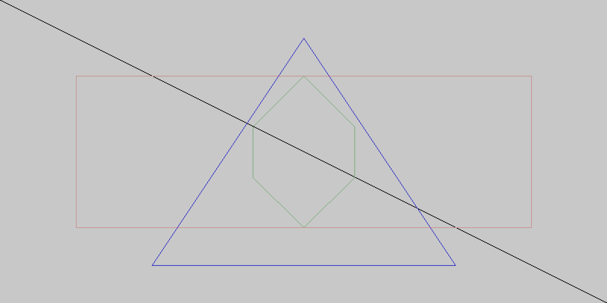

# go-canvas

図を描画するのに利用できるモジュールを製作中

## Usage
```go
package main

import (
    "image"
    "image/color"
	
    "github.com/melq/go-canvas"
)

func main() {
	c := NewCanvas(800, 400)

	c.SetBackground(color.RGBA{R: 200, G: 200, B: 200, A: 255})
	p1 := canvas.Point{X: 0, Y: 0}
	p2 := canvas.Point{X: 800, Y: 400}
	c.Line(p1, p2)
	c.ChangeColor(color.RGBA{R: 200, G: 150, B: 150, A: 255})
	p3 := canvas.Point{X: 100, Y: 100}
	p4 := canvas.Point{X: 700, Y: 300}
	c.Rect(p3, p4)
	p5 := canvas.Point{X: 400, Y: 50}
	p6 := canvas.Point{X: 600, Y: 350}
	p7 := canvas.Point{X: 200, Y: 350}
	c.ChangeColor(color.RGBA{R: 150, G: 150, B: 200, A: 255})
	c.Triangle(p5, p6, p7)
	p8 := canvas.Point{X: 400, Y: 100}
	p9 := canvas.Point{X: 467, Y: 167}
	p10 := canvas.Point{X: 467, Y: 234}
	p11 := canvas.Point{X: 400, Y: 300}
	p12 := canvas.Point{X: 333, Y: 234}
	p13 := canvas.Point{X: 333, Y: 167}
	c.ChangeColor(color.RGBA{R: 125, G: 175, B: 125, A: 255})
	c.Shape(p8, p9, p10, p11, p12, p13)
	c.SetScale(2)
	c.ToPng("./img/sample.png")
}
```

